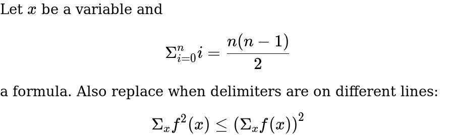

# katexify

Recursively walks a filesystem, katexifying all html files in its path. Turns `$...$` spans into inline math, and `$$...$$` into display math.

To print regular dollers, they can be escaped with backslashes and will be unescaped. For example:
`The sum of \$5 and \$3 is \$8` will become `The sum of $5 and $3 is $8`. To produce a regular backslash before a math span, escape backslash themselves:
`\\$f(x) = x^2$` will produce `\<span class="katex">…</span>`. Note that only escaped backslashes immediately preceding a doller will be unescaped. All
other escape sequences are untouched.

## Example

```html
<html>
    <head>
        <link rel="stylesheet" href="https://cdn.jsdelivr.net/npm/katex@0.10.1/dist/katex.min.css" integrity="sha384-dbVIfZGuN1Yq7/1Ocstc1lUEm+AT+/rCkibIcC/OmWo5f0EA48Vf8CytHzGrSwbQ" crossorigin="anonymous">
    </head>
    <body>
        Let $x$ be a variable and $$\Sigma_{i = 0}^n i = \frac{n(n-1)}{2}$$ a formula.
        Also replace when delimiters are on different lines:
        $$
            \Sigma_x {f^2(x)} \leq \left({ \Sigma_x f(x)}\right)^2
        $$
    </body>
</html>
```

renders to:




## Usage

Run test suite:
```bash
npm test
```

Simple usage without installation:
```
node bin/index.js <dir>
```

Note that katexify only produces the semantic structure in HTML. To properly render the math, you'll need KaTeX CSS. This can be loaded through a CDN by including
```html
<link rel="stylesheet" href="https://cdn.jsdelivr.net/npm/katex@0.10.1/dist/katex.min.css" integrity="sha384-dbVIfZGuN1Yq7/1Ocstc1lUEm+AT+/rCkibIcC/OmWo5f0EA48Vf8CytHzGrSwbQ" crossorigin="anonymous">
```
in your your HTML. For more information, check the [KaTeX browser installation page].

## Installation

```bash
sudo npm install -g
katexify <dir>
```

[KaTeX browser installation page]: https://katex.org/docs/browser.html
